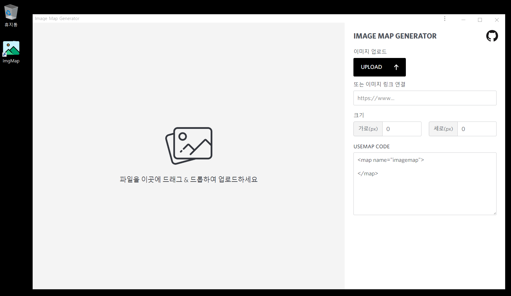

# Image Map Generator

이미지 맵을 생성하기 위한 [에디터](https://imgmap.now.sh/)

### 데스크톱 설치(PWA)

크롬 브라우저에서 아래 3개의 flag를 활성화 하세요.

1. App Banners: chrome://flags#enable-app-banners
2. Experimental App Banners: chrome://flags#enable-experimental-app-banners
3. Desktop PWAs: chrome://flags#enable-desktop-pwas

이후 [에디터](https://imgmap.now.sh/) 오른쪽 상단 "홈 화면에 앱 추가" 링크를 통해 설치하거나  
브라우저 메뉴(브라우저의 오른쪽 모서리에있는 세 개의 점)에서 Install + Website 이름을 볼 수 있습니다.